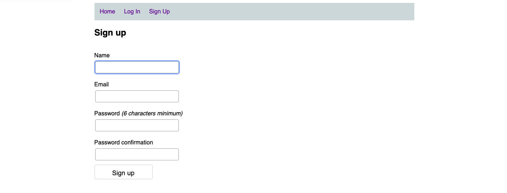
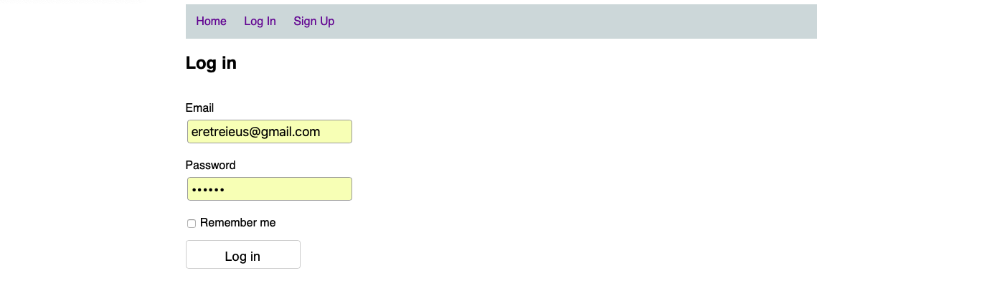
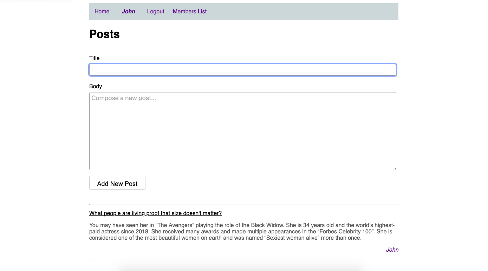

# Members Only

<!--
*** Thanks for checking out this README Template. If you have a suggestion that would
*** make this better, please fork the repo and create a pull request or simply open
*** an issue with the tag "enhancement".
*** Thanks again! Now go create something AMAZING! :D
-->

<!-- PROJECT SHIELDS -->
<!--
*** I'm using markdown "reference style" links for readability.
*** Reference links are enclosed in brackets [ ] instead of parentheses ( ).
*** See the bottom of this document for the declaration of the reference variables
*** for contributors-url, forks-url, etc. This is an optional, concise syntax you may use.
*** https://www.markdownguide.org/basic-syntax/#reference-style-links
-->

[![Contributors][contributors-shield]][contributors-url]
[![Forks][forks-shield]][forks-url]
[![Stargazers][stars-shield]][stars-url]
[![Issues][issues-shield]][issues-url]

<!-- PROJECT LOGO -->
<br />
<p align="center">
  <a href="https://github.com/ericmbouwe/Members-Only">
    
  </a>
  
  <h3 align="center">Members Only Application</h3>
  
  <p align="center">
    This project is part of the Microverse curriculum in Ruby On Rails course!
    <br />
    <a href="https://github.com/ericmbouwe/Members-Only"><strong>Explore the docs »</strong></a>
    <br />
    <br />
    <a href="https://github.com/ericmbouwe/Members-Only/issues">Report Bug</a>
    <a href="https://github.com/ericmbouwe/Members-Only/issues">Request Feature</a>
  </p>
</p>

This is blog style application which lets users sign up and add posts related to their account.  

<br />

<br />

<br />

<br />

<br />

<br />

<!-- TABLE OF CONTENTS -->

## Table of Contents

- [About the Project](#about-the-project)
- [Application Instructions](#application-instructions)
- [System Requierments](#system-requierments)
- [Dependencies](#dependencies)
- [Configuration](#configuration)
- [Development](#development)
- [Built With](#built-with)
- [Contributors](#contributors)
- [Acknowledgements](#acknowledgements)

<!-- ABOUT THE PROJECT -->

## About The Project  

  The project creates a database which holds 2 tables:  
    - Users  
      - Fields : name, email, encrypted_password, created_at, update_at, is_admin, is_member  
    
    - Posts  
      - Fields: title, body, user_id,created_at, update_a  

  Constrainsts for tables are as follows:  
  - Users Table
    - username: required  
    - email: required  
    - password: required  

  - Posts Table
    - title: minimum length 3  
    - body:  minimum length 6  

  We added our styling choices editing the application.scss file

<hr/>

<!-- ABOUT THE PROJECT -->

## Application Instructions  

  - Initially the application shows all the posts stored in the database, but can not add new posts and can not see the author of them  
  - New users must sign up and give a name, an email address and a password  
  - Using email and password they can log in  
  - A user has to log in in order to be able to add new posts.  
  - The first user which signs up is asigned an Administrator status property, so has access to other users properties by a provided menu option (Members List).  
  - An administrator can asign Administrative and Member statuses to other users.   
  - Each user has to be asigned a Member status property by an administrator user, in order to see the author of each post.  


<hr/>

## System Requierments
  - Ruby
  - Rails
  - Yarn

## Dependencies
  - devise gem
  - better_errors gem

## Configuration
  - first, clone the project 
  Run 
  ```
    git clone https://github.com/ericmbouwe/Members-Only.git
  ```

  - Install the necessary dependancies 
  Run 
  ```
    bundle install
    yarn install
  ```

<hr/>

## Development
  * Clone the project
  ```
    https://github.com/ericmbouwe/Members-Only.git
  ``` 
<hr/>

## Built With

This project was built using these technologies.

  - Ruby version 2.6
  - Ruby On Rails version 6.0
  - devise 4.7.1

<hr/>

<!-- CONTACT -->

## Contributors

:bust_in_silhouette: **Author_1**
## Eric Mbouwe

- Github: [@ericmbouwe](https://github.com/ericmbouwe)
- Twitter: [@ericmbouwe](https://twitter.com/ericmbouwe)
- Linkedin: [Eric Mbouwe](https://www.linkedin.com/in/ericmbouwe/)
- E-mail: ericmbouwe@gmail.com

:bust_in_silhouette: **Author_2**
​## Ioannis Kousis

- Github: [@ioanniskousis](https://github.com/ioanniskousis)
- Twitter: [@ioanniskousis](https://twitter.com/ioanniskousis)
- Linkedin: [Ioannis Kousis](https://www.linkedin.com/in/jgkousis)
- E-mail: jgkousis@gmail.com
​
<hr/>
<!-- ACKNOWLEDGEMENTS -->

## Acknowledgements

  - [Microverse](https://www.microverse.org/)
  - [The Odin Project](https://www.theodinproject.com/)
  - [Ruby Documentation](https://www.ruby-lang.org/en/documentation/)

<!-- MARKDOWN LINKS & IMAGES -->
<!-- https://www.markdownguide.org/basic-syntax/#reference-style-links -->

[contributors-shield]: https://img.shields.io/github/contributors/ericmbouwe/Members-Only.svg?style=flat-square
[contributors-url]: https://github.com/ericmbouwe/Members-Only/graphs/contributors
[forks-shield]: https://img.shields.io/github/forks/ericmbouwe/Members-Only.svg?style=flat-square
[forks-url]: https://github.com/ericmbouwe/Members-Only/network/members
[stars-shield]: https://img.shields.io/github/stars/ericmbouwe/Members-Only.svg?style=flat-square
[stars-url]: https://github.com/ericmbouwe/Members-Only/stargazers
[issues-shield]: https://img.shields.io/github/issues/ericmbouwe/Members-Only.svg?style=flat-square
[issues-url]: https://github.com/ericmbouwe/Members-Only/issues


